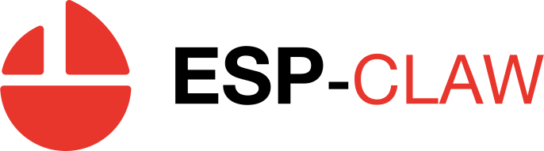
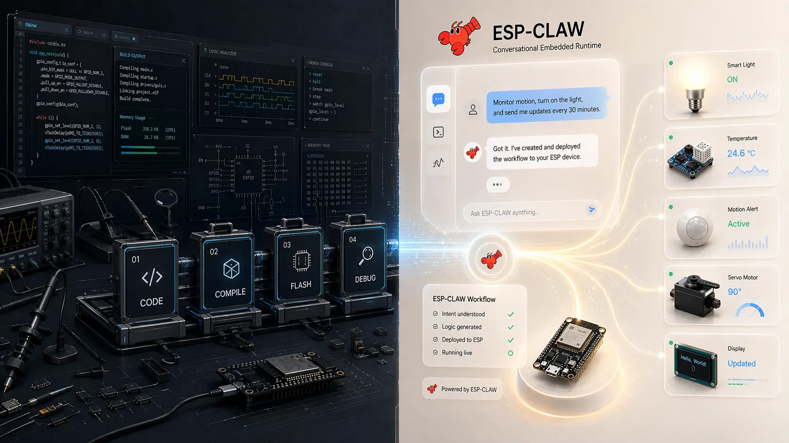
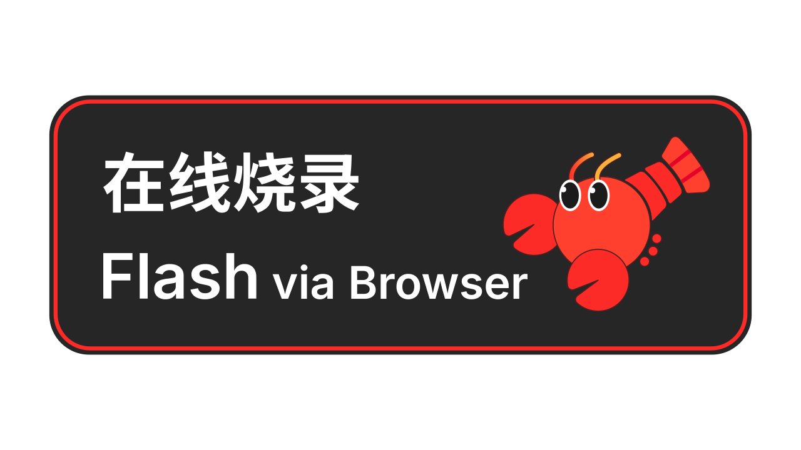
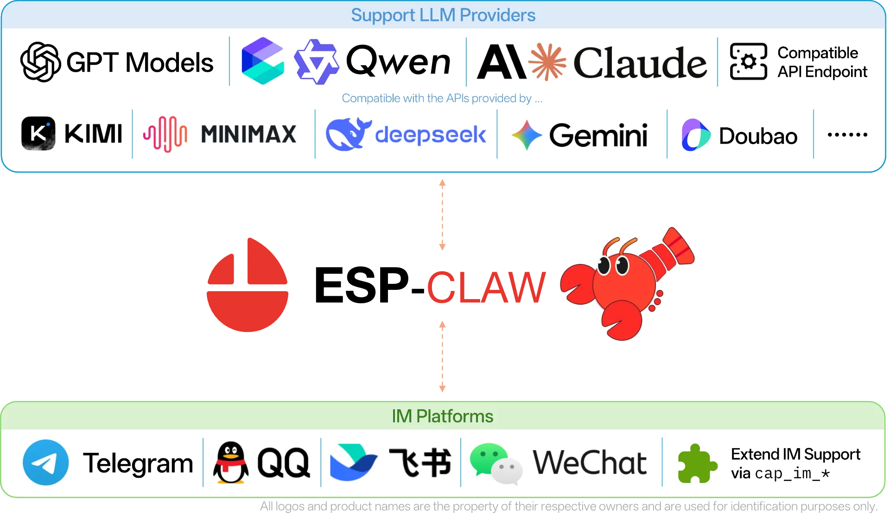

<div align="center">

  <a href="https://esp-claw.com/en/">
    <picture>
      <source media="(prefers-color-scheme: dark)" srcset="./docs/src/assets/logos/logo-f.svg" />
      <source media="(prefers-color-scheme: light)" srcset="./docs/src/assets/logos/logo.svg" />
      
    </picture>
  </a>
  
  <h1>Nano-Claw 🦞 Enhanced AI Agent Framework for ESP32-S3</h1>
  
  <h3>💬 Chat as Creation · 🔐 Secure by Default · 🚀 Millisecond Response · 🧩 Smart and Extensible</h3>
  
  <p>
    <a href="https://www.espressif.com">
      
    </a>
    <a href="./LICENSE">
      
    </a>
    <a href="./NANO_CLAW_FEATURES.md">
      
    </a>
  </p>

  <a href="#-key-features">Features</a>
  |
  <a href="#-whats-new-in-nano-claw">What's New</a>
  |
  <a href="#-quick-start">Quick Start</a>
  |
  <a href="#-documentation">Documentation</a>
  |
  <a href="./README_CN.md">简体中文</a>

</div>

**Nano-Claw** is an enhanced fork of Espressif's **ESP-Claw** AI agent framework, specifically optimized for ESP32-S3 N8R16 devices. Building on ESP-Claw's foundation, Nano-Claw adds enterprise-grade features like **secure device pairing**, **encrypted secrets vault**, and enhanced multi-channel IM support. Inspired by OpenClaw and reimplemented in C for resource-constrained IoT devices, Nano-Claw turns your $5 ESP32 chip into a secure, intelligent edge agent.

<div align="center">
  
</div>

## 🌟 Key Features

Traditional IoT usually stops at connectivity: devices can connect to the network, but they cannot think; they can execute commands, but they cannot make decisions. ESP-Claw brings the Agent Runtime down onto Espressif chips, turning them from passive executors into active decision-making centers.

<table align="center">
  <tr>
    <th><div align="center"> 💬 Chat as Creation </div></th>
    <th><div align="center"> ⚙️ Event Driven </div></th>
  </tr>
  <tr>
    <th>
      <div align="center">
        IM chat + dynamic Lua loading
        <br />
        Ordinary users can define device behavior without programming
      </div>
    </th>
    <th>
      <div align="center">
        Any event can trigger the Agent Loop and more
        <br />
        Response can be as fast as milliseconds
      </div>
    </th>
  </tr>
  <tr>
    <th width="45%">
      <video src="https://github.com/user-attachments/assets/717a4dae-fbd3-4364-afca-2d45432f156e" />
    </th>
    <th width="45%">
      <video src="https://github.com/user-attachments/assets/5a274a4a-e1dc-4c13-81aa-fb1c22d470bf" />
    </th>
  </tr>

  <tr>
    <td colspan="2"><!-- spacer row --></td>
  </tr>

  <tr>
    <th><div align="center"> 🧬 Structured Memory </div></th>
    <th><div align="center"> 📤 MCP Communication </div></th>
  </tr>
  <tr>
    <th>
      <div align="center">
        Organize memories in a structured way
        <br />
        Privacy stays off the cloud
      </div>
    </th>
    <th>
      <div align="center">
        Supports standard MCP devices
        <br />
        Works as both Server and Client
      </div>
    </th>
  </tr>
  <tr>
    <th width="45%">
      <video src="https://github.com/user-attachments/assets/2c8bcaa4-3606-49d3-9b70-86ad3234d48f" />
    </th>
    <th width="45%">
      <video src="https://github.com/user-attachments/assets/b1f71cee-e428-4b92-ad7e-d7816839f866" />
    </th>
  </tr>

  <tr>
    <td colspan="2"><!-- spacer row --></td>
  </tr>

  <tr>
    <th><div align="center"> 🧰 Ready Out of the Box </div></th>
    <th><div align="center"> 🧩 Component Extensibility </div></th>
  </tr>
  <tr>
    <th>
      <div align="center">
        Quick setup with Board Manager
        <br />
        Supports one-click flashing
      </div>
    </th>
    <th>
      <div align="center">
        Every module can be trimmed as needed
        <br />
        You can also add your own component integrations
      </div>
    </th>
  </tr>
</table>

## 📦 Quick Start

<div align="center">
  
</div>

ESP-Claw already supports multiple ESP32-S3-based development boards, including breadboards, M5Stack CoreS3, and more. Supported boards in [`./application/basic_demo/boards/`](./application/basic_demo/boards/) can be flashed online directly: configuration and flashing are done entirely in the browser, with no need to compile firmware locally or install a development environment first.

<div align="center">
  <a href="https://esp-claw.com/en/flash/">
    
  </a>
</div>

You can also build ESP-Claw locally. Please refer to the [local build documentation](https://esp-claw.com/en/tutorial/) for board adaptation, building, and flashing. Boards not listed above, as well as chips like the ESP32-P4, can also be supported through local builds and flashing.

You can find practical examples in our [documentation](https://esp-claw.com/en/tutorial/).

### Supported Platforms

<div align="center">
  <picture>
    <source media="(prefers-color-scheme: dark)" srcset="./docs/static/claw-providers-white.webp" />
    <source media="(prefers-color-scheme: light)" srcset="./docs/static/claw-providers-black.webp" />
    
  </picture>
</div>

**LLM**: ESP-Claw now supports both OpenAI-style APIs and Anthropic-style APIs. It natively supports GPT models from OpenAI, Qwen models from Alibaba Cloud Bailian, Claude models from Anthropic, DeepSeek models from DeepSeek API, and also supports custom endpoints.

> [!TIP]
>
> ESP-Claw's self-programming capability depends on models with strong tool use and instruction-following ability. We recommend `gpt-5.4`, `qwen3.6-plus`, `claude4.6-sonnet`, `deepseek-v4-pro` or models with comparable capability.

**IM**: ESP-Claw supports Telegram, QQ, Feishu, and WeChat, and can be extended further.

> [!NOTE]
>
> This project is still under active development. If you run into any issues, feel free to open an issue.

## 📷 Follow Us

If this project helps you, please consider giving it a star. ⭐⭐⭐⭐⭐

### Star History

<div align="center">
  <a href="https://www.star-history.com/?repos=espressif%2Fesp-claw&type=date&legend=top-left">
  <picture>
    <source media="(prefers-color-scheme: dark)" srcset="https://api.star-history.com/chart?repos=espressif/esp-claw&type=date&theme=dark&legend=top-left" />
    <source media="(prefers-color-scheme: light)" srcset="https://api.star-history.com/chart?repos=espressif/esp-claw&type=date&legend=top-left" />
    
  </picture>
  </a>
</div>

## Acknowledgements

Inspired by [OpenClaw](https://github.com/openclaw/openclaw).

The implementation of Agent Loop, IM communication, and related capabilities on ESP32 also draws on [MimiClaw](https://github.com/memovai/mimiclaw).

---

## 🆕 What's New in Nano-Claw

Nano-Claw extends ESP-Claw with **enterprise-grade security and management features**:

### 🔐 Device Pairing System (`cap_pairing`)
Enable secure device-to-user pairing through IM platforms using 8-character codes. No manual WiFi configuration needed!

**Features:**
- ✅ 8-character alphanumeric code generation (e.g., `A7K9-M2XQ`)
- ✅ Multi-channel support: Discord, Telegram, WeChat, QQ, Feishu
- ✅ 1-hour TTL with automatic expiry
- ✅ JSON-based persistent storage
- ✅ Auto-pruning of expired requests

**Use Case:** User sends `/start` to your Telegram bot → gets pairing code → device automatically links to their account.

📖 **Full Documentation:** [NANO_CLAW_FEATURES.md](./NANO_CLAW_FEATURES.md#1-device-pairing-system-cap_pairing--new)

### 🗄️ Encrypted Secrets Vault (`cap_secrets`)
Securely store API keys, tokens, passwords, and certificates with hardware-accelerated encryption.

**Features:**
- ✅ 5 secret types: String, API Key, Token, Password, Certificate
- ✅ AES-256-GCM encryption (software or ESP32 HMAC hardware)
- ✅ Metadata tracking (created/updated timestamps, access count)
- ✅ Export/import encrypted backups
- ✅ Secret rotation without name changes
- ✅ Secure wipe capability

**Use Case:** Store your OpenAI API key, Telegram bot token, and WiFi credentials encrypted in flash.

📖 **Full Documentation:** [NANO_CLAW_FEATURES.md](./NANO_CLAW_FEATURES.md#2-encrypted-secrets-vault-cap_secrets--new)

### 📊 Feature Comparison

| Feature | ESP-Claw | Nano-Claw |
|---------|----------|-----------|
| Device Pairing | ❌ | ✅ NEW |
| Encrypted Secrets Vault | ⚠️ Basic | ✅ Full Featured |
| Hardware Crypto Support | ❌ | ✅ ESP32 HMAC |
| Secret Rotation | ❌ | ✅ |
| Multi-channel Pairing | ❌ | ✅ 5 Platforms |
| Access Logging | ❌ | ✅ |

See complete comparison in [NANO_CLAW_FEATURES.md](./NANO_CLAW_FEATURES.md#-comparison-original-esp-claw-vs-nano-claw)

---

## 🛠️ Build & Configuration

### Enable Nano-Claw Features

In your `sdkconfig`, enable the new capabilities:

```bash
CONFIG_CLAW_ENABLE_PAIRING=y
CONFIG_CLAW_ENABLE_SECRETS_VAULT=y
CONFIG_CLAW_SECRETS_USE_HW_CRYPTO=y
```

### Memory Requirements

| Component | Flash | RAM | Storage |
|-----------|-------|-----|---------|
| Pairing System | ~180KB | ~45KB | ~2KB per pairing |
| Secrets Vault | ~145KB | ~28KB | ~600B per secret |
| **Total Overhead** | **~325KB** | **~73KB** | **Variable** |

✅ **ESP32-S3 N8R16 (8MB Flash, 16MB PSRAM) is fully capable!**

---

## 🧪 Quick Test

```c
#include "cap_pairing.h"
#include "cap_secrets.h"

void app_main(void) {
    // Initialize filesystem
    esp_vfs_spiffs_register(...);
    
    // Initialize pairing system
    cap_pairing_init("/spiffs/pairing");
    cap_pairing_register_group();
    
    // Initialize secrets vault
    cap_secrets_init("/spiffs/vault", NULL, 0);
    cap_secrets_set("openai_key", "sk-...", CAP_SECRETS_TYPE_API_KEY);
    
    // Your existing ESP-Claw setup...
}
```

Full examples in [NANO_CLAW_FEATURES.md](./NANO_CLAW_FEATURES.md#-usage-examples)

---
